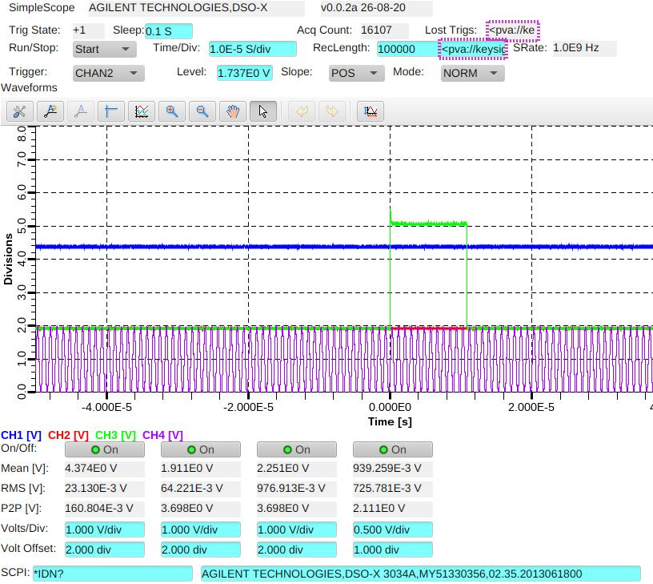

# epicsdev
EPICS PVAccess servers for various instruments

## Simulated instruments<br>
Multi-channel waveform generator:<br>
Module **epicdev.multiadc** can generate large amount of data for stress-testing
the EPICS environment. For example the following command will generate 100 of 
1000-pont noisy waveforms and 300 of scalar parameters:
```python -m epicsdev.multiadc -c100 -n1000```.

## Supported Oscilloscope series
- [RIGOL DHO](https://www.rigolna.com/products/rigol-digital-oscilloscopes/dho900)
- [TEKTRONIX MSO](https://www.tek.com/en/oscilloscope-mixed-signal-oscilloscope)
- [LECROY WAVERUNNER](https://www.teledynelecroy.com/wr9000)
- [KEYSIGHT (AGILENT) DSO-X](https://www.keysight.com/us/en/product/DSOX3034A/oscilloscope-350-mhz-4-channels.html)



## Magnetometers
- [LAKESHORE (model 421)](https://www.lakeshore.com/products/categories/magnetic-products/gaussmeters-teslameters)

## DAQ
- [CAEN DT5202](https://caen.it/products/dt5202)


